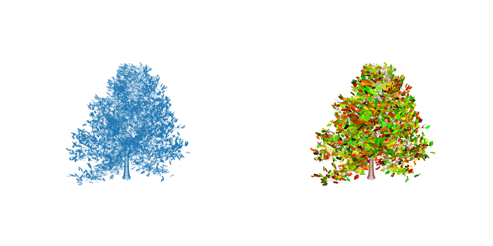

# tls_lidar_leaf_counting

This repository contains code and data for leaf counting and area estimation using 3D point cloud data obtained from terrestrial laser scanning (TLS) of trees. The project focuses on processing the point cloud data to identify and count leaves, as well as estimate their surface area.

For reading report, please refer to [Leaf Counting and Area Estimation using 3D Point Cloud Data.ipynb](./Leaf%20Counting%20and%20Area%20Estimation%20using%203D%20Point%20Cloud%20Data.ipynb) or [Leaf Counting and Area Estimation using 3D Point Cloud Data.pdf](./Leaf%20Counting%20and%20Area%20Estimation%20using%203D%20Point%20Cloud%20Data.pdf).

For inspecting code and visualizations, please refer to [leaf_counting.ipynb](./leaf_counting.ipynb).

For the case of multi-scan data, please refer to [leaf_counting_multi_scan.ipynb](./leaf_counting_multi_scan.ipynb).

For presentation slides, please refer to [TAU02E_seminar.pdf](./TAU02E_seminar.pdf).