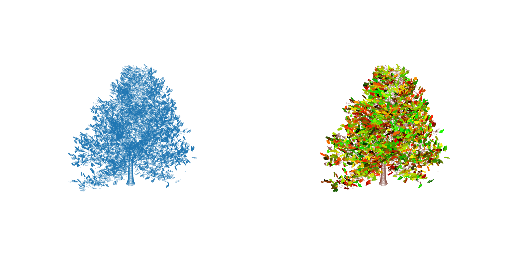

# Leaf Counting and Area Estimation using 3D Point Cloud Data

## Overview
This repository contains the methodology and codebase for quantifying leaves and estimating leaf area from 3D point cloud data. This project was developed as the final project for the Basic Course on Mathematical Modelling by Tomi Maijala and Vinh Van. 

The primary goal is to process terrestrial LiDAR scans to navigate the "semantic gap" between raw geometric coordinates and biological structures. 

## Dataset
* The project utilizes a dataset obtained from the HELIOS++ simulator.
* The data consists of 3D coordinates (X, Y, Z) representing a simulated tree.
* The point cloud was measured from a single position at `[0 0 1.5]`.
* The dataset contains no ground truth information for semantic or instance segmentation.

## Key Challenges
* **Data Quality**: Point density varies significantly depending on the distance from the LiDAR scanner and different sampling densities in horizontal and vertical directions.
* **Occlusion**: Dense canopies and the single scan position cause significant overlapping and hidden leaves.
* **Variability and Overlap**: Leaves vary in shape and size, and overlapping leaves create dense point clusters that are hard to separate.

## Methodology Pipeline
Our approach relies on geometric shape analysis and iterative clustering to identify and measure leaves:
1. **Preprocessing**: To mitigate severe occlusion issues, we filter the dataset to keep only the half of the tree facing the LiDAR scanner.
2. **Initial Clustering**: We group the tree into smaller, manageable clusters using the DBSCAN algorithm to reduce the search space.
3. **Leaf Identification**: We evaluate smaller clusters using exhaustive optimization with DBSCAN and RANSAC plane fitting. A cluster is deemed "leaf-like" based on specific planarity, separability, and size criteria determined via PCA and RANSAC.
4. **Area Estimation**: Because leaves are assumed to be mostly flat surfaces, we calculate the leaf area as half the surface area of the cluster's convex hull.
5. **Filtering**: To remove spurious data, we discard any identified leaf cluster with an area exceeding 0.2 m^2 or a maximum point distance greater than 1.0 m.

## Results
* **Single-Scan Estimation**: After filtering artifacts and compensating for the halved tree, the pipeline estimated a total of 916 leaves with a combined area of 55.59 m^2.
* **Occlusion Evaluation**: By running the pipeline on a multi-scan HELIOS++ dataset of the same tree model, we found 1256 leaves and a total area of 83.52 m^2. 
* **Conclusion**: Relying on a single scan resulted in approximately a 27% underestimation in leaf count and a 33% underestimation in total leaf area due to occlusion.

## Dependencies
This project relies on the following core Python libraries:
* `numpy` for numerical and array operations.
* `scikit-learn` for DBSCAN clustering, RANSAC regression, and Principal Component Analysis (PCA).
* `scipy` for computing the Convex Hull and point distances.
* `joblib` for parallelizing the cluster optimization process.

For short presentation slides, please refer to [TAU02E_seminar.pdf](./TAU02E_seminar.pdf).

For reading report, please refer to [Leaf Counting and Area Estimation using 3D Point Cloud Data.ipynb](./Leaf%20Counting%20and%20Area%20Estimation%20using%203D%20Point%20Cloud%20Data.ipynb) or [Leaf Counting and Area Estimation using 3D Point Cloud Data.pdf](./Leaf%20Counting%20and%20Area%20Estimation%20using%203D%20Point%20Cloud%20Data.pdf).

For inspecting code and visualizations, please refer to [leaf_counting.ipynb](./leaf_counting.ipynb) or [leaf_counting.pdf](./leaf_counting.pdf).

For the case of multi-scan data, please refer to [leaf_counting_multi_scan.ipynb](./leaf_counting_multi_scan.ipynb) or [leaf_counting_multi_scan.pdf](./leaf_counting_multi_scan.pdf).

